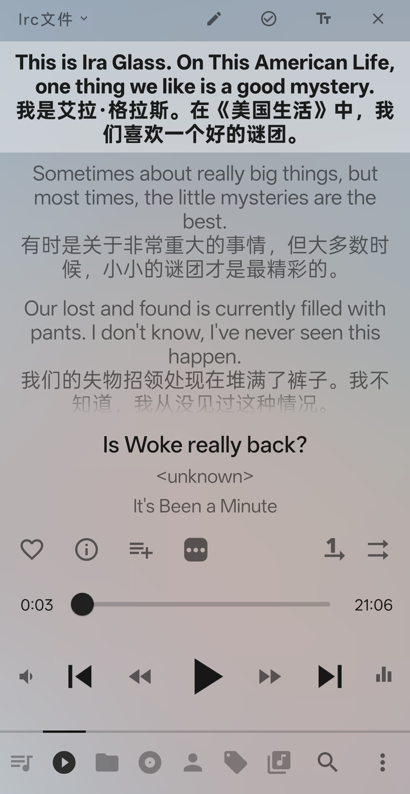

# 🎙️ Audio2LRC: 英文播客/音频自动转中文字幕

[](https://colab.research.google.com/drive/1aXjREXsk4NfhsIftpBXBs8hmUfhI2zpq?usp=sharing)

> "我想听英文播客的时候发现，这些播客都没有中文字幕，于是就有了这个项目。"

## 📖 项目介绍

本项目是一个运行在 Google Colab 上的自动化脚本，旨在将英文音频（MP3/WAV等）快速转换为 **中英对照的 LRC 歌词文件**。

**为什么选择 LRC 格式？**
对于播客（Podcast）或音频听众来说，LRC 格式比 SRT 更实用。只需将生成的 `.lrc` 文件与音频文件命名一致并放在同一目录下，大多数主流音乐播放器（如 Musicolet, Salt Player等）即可自动识别并滚动显示歌词。

### ✨ 核心特性

- **零成本**: 完全依托 [Google Colab](https://colab.google/) 的免费 T4 GPU 资源运行。
- **极速转录**: 使用 OpenAI 的 **Whisper (Turbo模型)**，转录速度极快且准确。
- **AI 翻译**: 支持接入 OpenAI 兼容格式的 API（如 GPT-4o-mini, DeepSeek 等）进行高质量翻译。
- **并发加速**: 内置多线程并发翻译机制，长音频处理效率高。
- **自动清洗**: 自动处理文件名中的特殊字符，防止转录出错。

---

## ⚙️ 准备工作

在使用脚本前，请先在您的 Google Drive 中准备好以下环境：

1.  **创建文件夹**：
    在 Google Drive 根目录下新建一个文件夹，命名为 `podcast`。
    - 完整路径应为：`/content/drive/MyDrive/podcast`
2.  **上传音频**：
    将需要转换的英文音频文件上传到该文件夹中。

---

## 🚀 快速开始

1.  点击上方的 **"Open in Colab"** 按钮打开笔记本。
2.  **连接运行时**：点击右上角 "连接"，建议选择 T4 GPU 环境。
3.  **配置参数**：
    找到 **[Step 2]** 代码块，修改以下关键信息：

    ```python
    # 1. 原始文件名 (填入 Drive 里真实的文件名，包含空格/问号都没关系)
    AUDIO_FILENAME = "example.mp3"

    # 3. API 设置 (请修改)
    API_KEY = "******************"
    BASE_URL = "https://**********************/v1"
    MODEL_NAME = "gpt-4.1-mini"
    ```

4.  **运行脚本**：
    点击菜单栏的 **"代码执行程序" -> "全部运行"**，或者依次点击每个单元格左侧的播放按钮。

等待片刻，生成的 `.lrc` 文件将自动保存回您的 Google Drive `podcast` 文件夹中。

---

## 🖼️ 效果示例



## ⚠️ 隐私说明

- **API Key 安全**: 本 Notebook 运行在您的私人 Google Colab 环境中。但在分享修改后的副本给他人前，请务必删除代码框中填写的 `API_KEY`。
- **数据安全**: 脚本仅申请 Google Drive 挂载权限以读取音频和保存字幕，不会上传数据到其他服务器（除您配置的翻译 API 接口外）。
